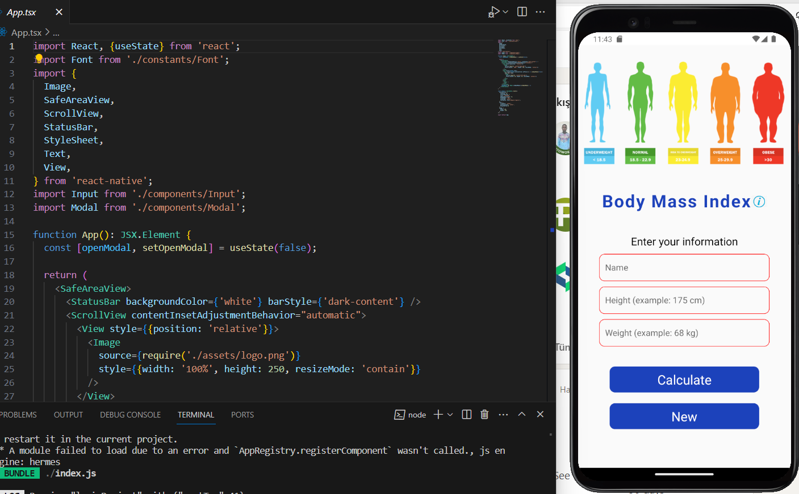

# React-Native Project

# Body Mass Index

- The body mass index (BMI) is a measure that uses your height and weight to work out if your weight is healthy.

- The calculator will give you an idea of how your weight compares to common values. Body Mass Index (or BMI) is calculated as your weight (in kilograms) divided by the square of your height (in metres) or BMI = Kg/M2.

## Preview

# Body_Mass_Index-ReactNative
